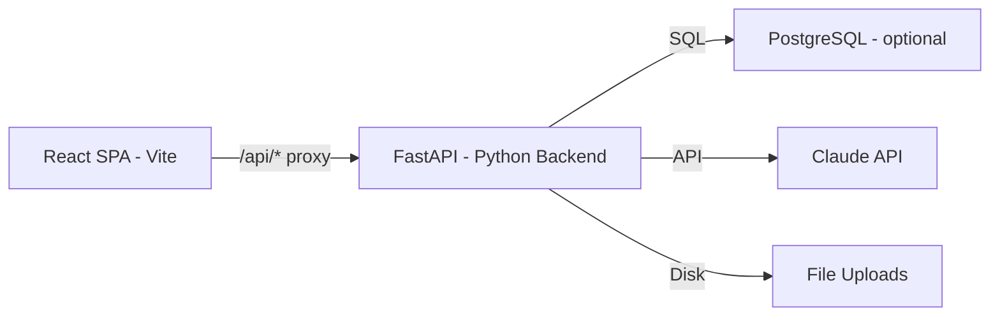

# Ditch Gradio, Restore React Frontend + Corgi Branding

## Problem Summary

The Python rewrite replaced the polished React chat UI with Gradio, which resulted in:

1. **Broken chat experience** — Huge empty spaces, no typing indicator, clunky file upload widget, synchronous response blocking (no streaming feel)
2. **Lost Corgi branding** — Everything says "AI Insurance Advisor" with a 🛡️ shield emoji instead of the Corgi logo and Trudy personality
3. **DB crash on send** — `session.py` hard-requires PostgreSQL for every message; no fallback when DB is offline
4. **Generic Gradio look** — Default Gradio chrome, footer, and layout that doesn't match the original clean chat design

## Solution

**Ditch Gradio entirely.** Keep the Python/FastAPI backend but replace the Gradio UI layer with the original React frontend. The React client code is still intact in `client/`.

### Architecture



In development: React dev server on port 5173 proxies `/api/*` to FastAPI on port 7860.
In production: FastAPI serves the built React static files directly.

### API Contract

The React frontend expects these endpoints, which currently exist in the Express.js server. We need to recreate them as FastAPI routes:

| Method | Path | Purpose | Express Source |
|--------|------|---------|---------------|
| `POST` | `/api/sessions` | Create new session | `sessions.js:6` |
| `GET` | `/api/sessions` | List sessions | `sessions.js:14` |
| `GET` | `/api/sessions/:id` | Get session + messages | `sessions.js:22` |
| `POST` | `/api/chat/message` | Send message with optional file | `chat.js:77` |
| `POST` | `/api/chat/:id/complete` | Trigger extraction | `chat.js:175` |
| `GET` | `/api/intakes` | List intakes | `intakes.js:7` |
| `GET` | `/api/intakes/:id` | Get intake data | `intakes.js:16` |
| `GET` | `/api/intakes/:id/transcript` | Get conversation transcript | `intakes.js:29` |
| `GET` | `/api/health` | Health check | Already exists |

### Response Formats

The React client expects these JSON shapes:

**POST /api/sessions** returns:
```json
{ "id": "uuid", "status": "active", "created_at": "..." }
```

**GET /api/sessions/:id** returns:
```json
{ "id": "uuid", "status": "active", "messages": [{ "role": "user", "content": "...", "attachments": [], "created_at": "..." }] }
```

**POST /api/chat/message** accepts JSON body `{ session_id, content }` or multipart form with `session_id`, `content`, `file`. Returns:
```json
{ "role": "assistant", "content": "...", "is_complete": false }
```

**POST /api/chat/:id/complete** returns:
```json
{ "message": "Intake extraction complete", "intake": { ... } }
```

---

## Changes Required

### 1. Python Backend — Replace Gradio with FastAPI REST Routes

**File: `app/main.py`** — Complete rewrite
- Remove all Gradio imports and mounting
- Add FastAPI routers for sessions, chat, intakes
- Add CORS middleware for dev mode
- Add static file serving for production React build

**New file: `app/routes/sessions.py`** — Session endpoints
- `POST /api/sessions` → calls `session_svc.create_session()`
- `GET /api/sessions` → calls `session_svc.list_sessions()`
- `GET /api/sessions/{id}` → calls `session_svc.get_session_with_messages()`

**New file: `app/routes/chat.py`** — Chat endpoints
- `POST /api/chat/message` → handles text + file upload, calls Claude, returns response
- `POST /api/chat/{session_id}/complete` → triggers extraction

**New file: `app/routes/intakes.py`** — Intake endpoints
- `GET /api/intakes` → list all intakes
- `GET /api/intakes/{session_id}` → get specific intake
- `GET /api/intakes/{session_id}/transcript` → get conversation transcript

### 2. In-Memory Session Fallback

**File: `app/services/session.py`** — Add fallback
- When PostgreSQL is unavailable, use an in-memory dict store
- Same API surface, just backed by dicts instead of SQL
- Allows the app to work for development/demo without a DB

**File: `app/database.py`** — Graceful degradation
- `query()` and `query_one()` should raise a clear error when DB is down
- Session service catches this and falls back to in-memory

### 3. Corgi Branding Restoration — React Client

**File: `client/index.html`**
- Title: "AI Insurance Advisor" → "Corgi Insurance Broker"
- Favicon: `/shield.svg` → `/corgi-logo.webp`

**File: `client/src/components/ChatHeader.jsx`**
- Logo: 🛡️ emoji → `` tag with corgi-logo.webp
- Title: "AI Insurance Advisor" → "Corgi Insurance Broker"
- Subtitle: "AI Insurance Co-Pilot" → "AI-Powered Insurance Intake"

**File: `client/src/App.jsx`**
- Welcome logo: 🛡️ → `` with corgi-logo.webp
- Welcome title: "Welcome to AI Insurance Advisor" → "Welcome to Corgi Insurance"
- Welcome text: "I am your AI insurance co-pilot..." → "Hi! I am Trudy, your AI insurance advisor..."

**File: `client/src/components/MessageBubble.jsx`**
- Avatar: 🛡️ → 🐕 (already 🐕 in TypingIndicator, make consistent)

**File: `client/public/`**
- Copy `corgi-logo.webp` from `C:\Users\alega\OneDrive\Escritorio\Corgi\corgi-logo.webp`

### 4. Corgi Branding — System Prompts

**File: `app/prompts/system.py`**
- "You are a friendly and knowledgeable AI insurance advisor" → "You are Trudy, a friendly and knowledgeable AI insurance advisor at Corgi Insurance"
- Add Trudy personality references

**File: `app/prompts/extraction.py`**
- "between an AI insurance advisor and a client" → "between an insurance broker AI named Trudy and a client"

### 5. Configuration Updates

**File: `client/vite.config.js`**
- Proxy target: `http://localhost:3001` → `http://localhost:7860`

**File: `requirements.txt`**
- Remove `gradio>=4.44.0`
- Keep everything else

### 6. Cleanup

- `app/ui/` directory — can be removed entirely since Gradio UI code is no longer needed
- `app/ui/chat.py`, `app/ui/theme.py`, `app/ui/__init__.py` — delete

---

## File Impact Summary

| File | Action |
|------|--------|
| `app/main.py` | Rewrite — FastAPI with REST routes, no Gradio |
| `app/routes/__init__.py` | New — routes package |
| `app/routes/sessions.py` | New — session REST endpoints |
| `app/routes/chat.py` | New — chat REST endpoints with file upload |
| `app/routes/intakes.py` | New — intake REST endpoints |
| `app/services/session.py` | Modify — add in-memory fallback |
| `app/database.py` | Modify — graceful DB-offline handling |
| `app/prompts/system.py` | Modify — Corgi/Trudy branding |
| `app/prompts/extraction.py` | Modify — Corgi/Trudy branding |
| `requirements.txt` | Modify — remove gradio |
| `app/ui/chat.py` | Delete |
| `app/ui/theme.py` | Delete |
| `app/ui/__init__.py` | Delete |
| `client/index.html` | Modify — Corgi title + favicon |
| `client/src/App.jsx` | Modify — Corgi welcome section |
| `client/src/components/ChatHeader.jsx` | Modify — Corgi logo + title |
| `client/src/components/MessageBubble.jsx` | Modify — Corgi avatar |
| `client/src/constants/theme.js` | Modify — update branding names |
| `client/vite.config.js` | Modify — proxy to port 7860 |
| `client/public/corgi-logo.webp` | New — copy from OneDrive |

---

## Development Workflow

1. Start Python backend: `cd "d:\Corgi Testing\AIB" && python -m app` (port 7860)
2. Start React dev server: `cd "d:\Corgi Testing\AIB\client" && npm run dev` (port 5173, proxies to 7860)
3. Open `http://localhost:5173` for the full experience

For production, run `npm run build` in client/, then FastAPI serves the `client/dist/` folder as static files.
