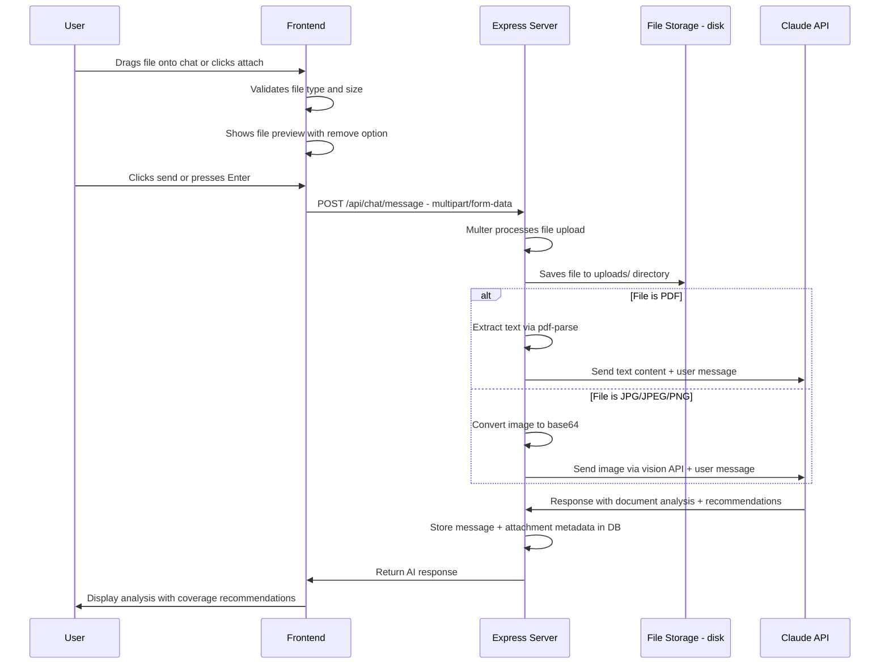

# AIB — Document Upload & Analysis + Rebranding Plan

## Overview

Two workstreams:
1. **Rebranding** — Rename from "Corgi Insurance Broker / Trudy" to "AI Insurance Advisor" with "AI Insurance Co-Pilot" subtitle. Remove all bot name references.
2. **Document Upload & Analysis** — Add drag-and-drop file support (JPG, JPEG, PNG, PDF) so the AI can analyze insurance documents in real-time, identify existing policies, and recommend additional coverages.

---

## Architecture

### Document Upload Flow



### How Claude Receives Documents

**For images (JPG/JPEG/PNG):** Use Claude's native vision API. The message content becomes an array:
```json
{
  "role": "user",
  "content": [
    {
      "type": "image",
      "source": {
        "type": "base64",
        "media_type": "image/jpeg",
        "data": "<base64-encoded-image>"
      }
    },
    {
      "type": "text",
      "text": "User message or default: Please analyze this insurance document."
    }
  ]
}
```

**For PDFs:** Extract text using `pdf-parse`, then send as a text block:
```json
{
  "role": "user", 
  "content": [
    {
      "type": "text",
      "text": "[UPLOADED DOCUMENT: policy.pdf]\n\n<extracted text content>\n\n[END DOCUMENT]\n\nUser message here"
    }
  ]
}
```

---

## Workstream A: Rebranding

### Files to Change

| File | What Changes |
|------|-------------|
| `client/index.html` | Title: "AI Insurance Advisor" |
| `client/src/components/ChatHeader.jsx` | Title: "AI Insurance Advisor", Subtitle: "AI Insurance Co-Pilot" |
| `client/src/App.jsx` | Welcome text: remove "Trudy", remove "Corgi Insurance" |
| `client/src/constants/theme.js` | Update comments only |
| `server/src/prompts/system.js` | Remove "Trudy" name, remove "Corgi" references, keep personality but make it generic |
| `server/src/prompts/extraction.js` | Remove "Trudy" reference |

### Branding Changes Detail

- **Header title**: "Corgi Insurance Broker" → "AI Insurance Advisor"
- **Header subtitle**: "AI-Powered Insurance Intake" → "AI Insurance Co-Pilot"  
- **Welcome title**: "Welcome to Corgi Insurance" → "Welcome to AI Insurance Advisor"
- **Welcome text**: "Hi! I'm Trudy, your AI insurance advisor..." → "Hi! I'm your AI insurance co-pilot..."
- **System prompt**: "You are Trudy, a friendly..." → "You are a friendly and knowledgeable AI insurance advisor..."
- **Extraction prompt**: "between an insurance broker AI (Trudy)" → "between an AI insurance advisor"
- **Logo emoji**: Keep 🐕 or change — user to decide

---

## Workstream B: Document Upload & Analysis

### Backend Changes

#### 1. New dependency: `pdf-parse`
Install in server: `npm install pdf-parse`

#### 2. File upload handling in chat route (`server/src/routes/chat.js`)

Replace the current JSON-only `POST /api/chat/message` with a multipart-capable endpoint:

- Configure multer with:
  - File filter: `.jpg`, `.jpeg`, `.png`, `.pdf` only
  - Size limit: 10MB per file
  - Storage: `uploads/` directory on disk
  - Single file field name: `file`
- When a file is present:
  - For images: read file, convert to base64, build vision content array
  - For PDFs: extract text with pdf-parse, wrap in document markers
- Store file metadata in the message attachments JSONB column

#### 3. Update `anthropic.js` chat function

The current `chat()` function maps messages to simple `{ role, content: string }`. It needs to support content arrays for multimodal messages:

```javascript
// Current — text only
messages: messages.map(m => ({
  role: m.role,
  content: m.content,  // always a string
}))

// New — supports both text and multimodal
messages: messages.map(m => ({
  role: m.role,
  content: m.content,  // can be string OR array of content blocks
}))
```

The key insight: we build the multimodal content array in the chat route when processing the current message, store a text summary in the DB, but pass the full content array to Claude for the current turn.

#### 4. New document analysis prompt (`server/src/prompts/document-analysis.js`)

A specialized prompt fragment injected when documents are uploaded:

```
When the user uploads an insurance document, you should:
1. Identify the type of document - policy dec page, certificate of insurance, endorsement, etc.
2. Extract key details: carrier, policy number, effective dates, coverage types, limits, deductibles
3. Summarize what coverages the client currently has
4. Based on their business profile and existing coverages, proactively recommend additional coverages they should consider
5. Explain WHY each recommended coverage is relevant to their specific business
```

This gets added to the system prompt.

#### 5. Update system prompt

Add a new section for document handling:

```
## Document Analysis
When a client uploads insurance documents such as policy declaration pages, certificates of insurance, or endorsements:
1. Carefully analyze the document content
2. Identify and summarize: carrier name, policy type, policy number, effective/expiration dates, coverage limits, deductibles, named insureds
3. Based on the coverages found AND the client business information gathered, proactively recommend additional coverage lines they should consider
4. Explain your recommendations in plain language, connecting each suggestion to their specific business risks
5. Flag any coverage gaps or concerns you notice such as low limits, missing endorsements, or expiring policies
```

### Frontend Changes

#### 1. Update `InputBar.jsx` — Drag-and-drop + file picker

- Add a hidden `<input type="file">` accepting `.jpg,.jpeg,.png,.pdf`
- Add a paperclip/attach button next to the send button
- Wrap the input area in a drop zone with `onDragOver`, `onDragEnter`, `onDragLeave`, `onDrop` handlers
- Visual feedback: border highlight when dragging over
- When file is selected/dropped: validate type and size, store in component state
- Show file preview strip above the textarea when files are attached
- Pass file along with text content to `onSend()`

#### 2. New `FilePreview.jsx` component

Shows attached file before sending:
- For images: thumbnail preview
- For PDFs: PDF icon + filename
- Remove button (X) to detach
- File size display

#### 3. Update `useChat.js` hook

- `send()` signature changes from `send(content)` to `send(content, file)`
- When file is present, call the new multipart API function
- Optimistic user message includes attachment indicator

#### 4. Update `api.js`

- New `sendMessageWithFile(sessionId, content, file)` function using `FormData`
- Remove the hardcoded `Content-Type: application/json` header for this call so the browser sets the multipart boundary automatically

#### 5. Update `MessageBubble.jsx`

- Check for attachments in the message
- Display attachment indicator: file icon + filename below the message text
- For images: optionally show a small thumbnail in the bubble

#### 6. CSS additions in `index.css`

- `.input-drop-zone` — drag-over highlight state
- `.input-drop-zone.dragging` — dashed border, light background
- `.file-preview-strip` — horizontal strip above textarea
- `.file-preview-item` — individual file preview card
- `.file-preview-thumbnail` — image thumbnail
- `.file-preview-remove` — X button
- `.message-attachment` — attachment indicator in message bubbles

### Extraction Service Update

Update `extraction.js` to include document content in the transcript sent for extraction. The attachments metadata stored in messages should be referenced so the extraction prompt can capture `uploaded_documents` with meaningful data like policy types and carriers found.

---

## File Change Summary

### New Files
| File | Purpose |
|------|---------|
| `server/src/prompts/document-analysis.js` | Document analysis prompt fragment |
| `server/uploads/` | Directory for uploaded files - gitignored |
| `client/src/components/FilePreview.jsx` | File preview component for attached files |

### Modified Files
| File | Changes |
|------|---------|
| `server/package.json` | Add `pdf-parse` dependency |
| `server/src/index.js` | Serve uploads directory as static if needed |
| `server/src/prompts/system.js` | Rebrand + add document analysis section |
| `server/src/prompts/extraction.js` | Rebrand + handle document data |
| `server/src/services/anthropic.js` | Support multimodal content arrays |
| `server/src/routes/chat.js` | Add multer, file processing, multimodal message building |
| `server/src/services/extraction.js` | Include attachment data in transcript |
| `client/index.html` | Update title |
| `client/src/components/ChatHeader.jsx` | Rebrand title and subtitle |
| `client/src/components/InputBar.jsx` | Add drag-drop, file picker, file state |
| `client/src/components/MessageBubble.jsx` | Show attachment indicators |
| `client/src/components/CompletionPanel.jsx` | No changes needed |
| `client/src/hooks/useChat.js` | Support file in send function |
| `client/src/services/api.js` | Add multipart form data upload |
| `client/src/constants/theme.js` | Update comments |
| `client/src/App.jsx` | Rebrand welcome section |
| `client/src/index.css` | Add drag-drop and file preview styles |

---

## Implementation Order

1. **Rebranding first** — quick wins, no architectural changes
2. **Backend file handling** — multer setup, PDF parsing, multimodal Claude calls
3. **System prompt updates** — document analysis instructions
4. **Frontend drag-and-drop** — InputBar + FilePreview + API changes
5. **Message display** — attachment indicators in bubbles
6. **Extraction updates** — include document data
7. **End-to-end testing**
