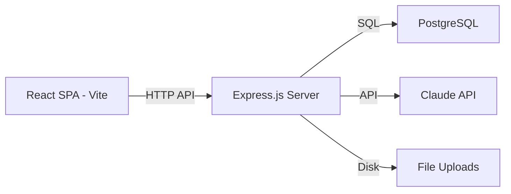
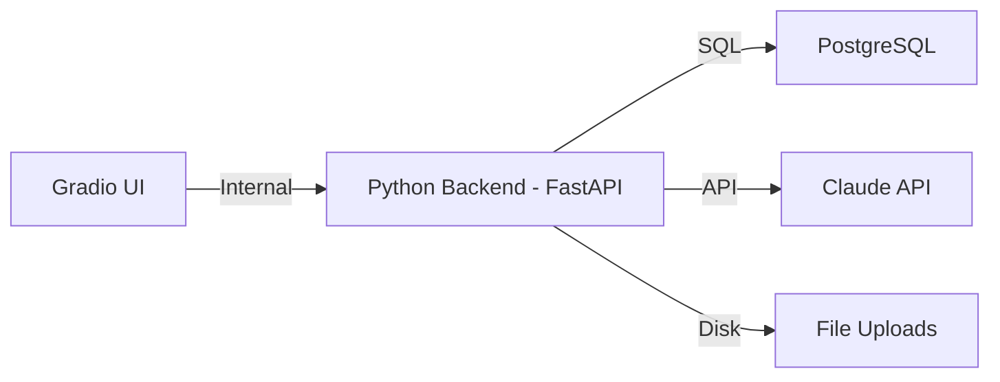
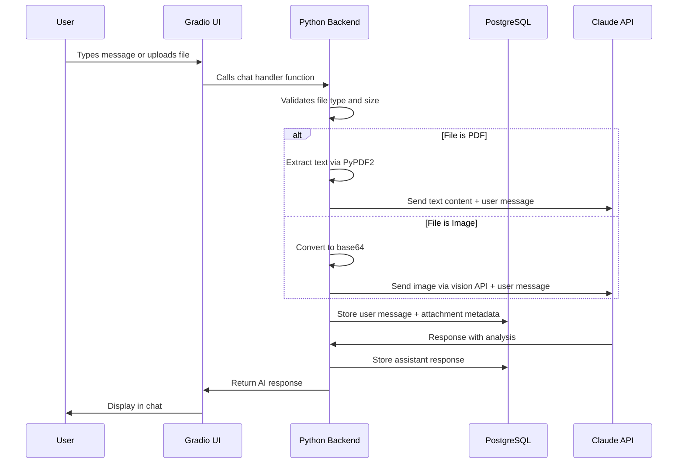

# AIB — Full Python Rewrite with Corgi Branding Restoration

## Overview

Complete rewrite of the AIB application from Node.js/React to Python/Gradio, while restoring the original Corgi Insurance Broker branding that was removed in the last commit.

### What Changes
1. **Backend**: Node.js/Express → Python with FastAPI (API layer behind Gradio)
2. **Frontend**: React SPA → Gradio chat interface
3. **Branding**: "AI Insurance Advisor" → restored "Corgi Insurance Broker" with Trudy personality
4. **Database**: PostgreSQL stays the same (same schema)
5. **Deployment**: Docker Compose stays, updated for Python

### What Stays the Same
- PostgreSQL database and schema
- Anthropic Claude API integration (same model, same prompts logic)
- Core business logic (3-phase intake conversation, extraction, document analysis)
- File upload support (JPG, PNG, PDF)
- Docker Compose orchestration pattern

---

## Architecture

### Current Architecture (Node.js/React)



### New Architecture (Python/Gradio)



Key difference: Gradio serves both the UI and the API from a single Python process. We use FastAPI as the underlying ASGI app (Gradio mounts on FastAPI natively) so we can still expose REST endpoints for health checks and potential external integrations.

### Document Upload Flow



---

## Project Structure

```
AIB/
├── app/
│   ├── __init__.py
│   ├── main.py                  # Entry point — launches Gradio + FastAPI
│   ├── config.py                # Environment config loader
│   ├── database.py              # PostgreSQL connection pool
│   ├── ui/
│   │   ├── __init__.py
│   │   ├── chat.py              # Gradio chat interface
│   │   ├── theme.py             # Corgi brand theme and CSS
│   │   └── components.py        # Custom Gradio components
│   ├── services/
│   │   ├── __init__.py
│   │   ├── anthropic_client.py  # Claude API wrapper
│   │   ├── session.py           # Session CRUD
│   │   ├── extraction.py        # Intake data extraction
│   │   └── file_processor.py    # File upload handling
│   ├── prompts/
│   │   ├── __init__.py
│   │   ├── system.py            # System prompt - Corgi/Trudy branding
│   │   └── extraction.py        # Extraction prompt - Corgi/Trudy branding
│   └── middleware/
│       ├── __init__.py
│       ├── rate_limiter.py      # Rate limiting
│       └── error_handler.py     # Error handling
├── uploads/                     # Uploaded files directory
│   └── .gitkeep
├── assets/
│   ├── corgi.svg                # Corgi logo
│   └── shield.svg               # Shield logo
├── db/
│   └── schema.sql               # Same PostgreSQL schema
├── requirements.txt             # Python dependencies
├── Dockerfile                   # Single Dockerfile for the Python app
├── docker-compose.yml           # Updated for Python
├── .env.example                 # Environment variables template
└── .gitignore
```

---

## Branding Restoration

### Name Changes
| Location | Current - to revert | Restored |
|----------|-----------|----------|
| Page title | AI Insurance Advisor | Corgi Insurance Broker |
| Header title | AI Insurance Advisor | Corgi Insurance Broker |
| Header subtitle | AI Insurance Co-Pilot | AI-Powered Insurance Intake |
| Welcome title | Welcome to AI Insurance Advisor | Welcome to Corgi Insurance |
| Welcome text | I am your AI insurance co-pilot... | Hi! I am Trudy, your AI insurance advisor... |
| System prompt | You are a friendly AI insurance advisor... | You are Trudy, a friendly AI insurance advisor at Corgi Insurance... |
| Extraction prompt | an AI insurance advisor | an insurance broker AI named Trudy |
| Logo/Avatar | Shield emoji 🛡️ | Corgi emoji 🐕 |

### Logo Files
- Restore `corgi.svg` as the primary logo (orange circle with 🐕)
- Keep `shield.svg` as secondary icon
- Use 🐕 emoji as the chat avatar for Trudy

---

## Technology Stack

### Python Dependencies

| Package | Purpose | Replaces |
|---------|---------|----------|
| `gradio>=4.0` | Chat UI framework | React + Vite |
| `fastapi` | ASGI app, health endpoints | Express.js |
| `uvicorn` | ASGI server | Node.js runtime |
| `anthropic` | Claude API SDK | @anthropic-ai/sdk |
| `psycopg2-binary` | PostgreSQL driver | pg |
| `python-dotenv` | Environment variables | dotenv |
| `PyPDF2` | PDF text extraction | pdf-parse |
| `Pillow` | Image processing | fs (Node built-in) |
| `slowapi` | Rate limiting | express-rate-limit |
| `python-multipart` | File upload handling | multer |

---

## Module-by-Module Mapping

### 1. Config — `app/config.py`
**Replaces**: `server/src/config/env.js`

- Load `.env` via `python-dotenv`
- Validate `ANTHROPIC_API_KEY` is present
- Export config object with: `anthropic_api_key`, `db_url`, `port`, `debug`

### 2. Database — `app/database.py`
**Replaces**: `server/src/config/database.js`

- Create connection pool using `psycopg2`
- `query()` function for parameterized queries
- `test_connection()` health check
- Connection pool management

### 3. Session Service — `app/services/session.py`
**Replaces**: `server/src/services/session.js`

Functions (1:1 mapping):
- `create_session()` → INSERT into sessions
- `get_session(session_id)` → SELECT by UUID
- `get_session_with_messages(session_id)` → JOIN with messages
- `list_sessions(status=None)` → SELECT with optional filter
- `update_session_status(session_id, status)` → UPDATE
- `add_message(session_id, role, content, attachments=[])` → INSERT into messages
- `get_messages(session_id)` → SELECT ordered by created_at

### 4. Anthropic Client — `app/services/anthropic_client.py`
**Replaces**: `server/src/services/anthropic.js`

Functions:
- `chat(messages)` → Send conversation to Claude, supports text and multimodal content arrays
- `build_multimodal_content(user_text, file_data)` → Build content blocks for images/PDFs
- `extract(extraction_prompt)` → Run extraction, parse JSON response

### 5. File Processor — `app/services/file_processor.py`
**Replaces**: File processing logic in `server/src/routes/chat.js`

Functions:
- `validate_file(file)` → Check type (JPG/PNG/PDF) and size (max 10MB)
- `process_file(file_path, filename, mime_type)` → Returns processed file data
  - Images: read + base64 encode
  - PDFs: extract text via PyPDF2
- `save_upload(file)` → Save to uploads/ directory with unique name

### 6. Extraction Service — `app/services/extraction.py`
**Replaces**: `server/src/services/extraction.js`

Functions:
- `extract_intake_data(session_id)` → Build transcript, run extraction, store in DB
- `store_intake(session_id, data)` → UPSERT into intakes table
- `get_intake(session_id)` → SELECT from intakes
- `list_intakes()` → SELECT all with session join

### 7. System Prompt — `app/prompts/system.py`
**Replaces**: `server/src/prompts/system.js`

Restore Corgi/Trudy branding:
- "You are Trudy, a friendly and knowledgeable AI insurance advisor at Corgi Insurance..."
- Keep all 3 phases (Discovery, Details, Confirm & Close)
- Keep document analysis section
- Keep all formatting rules

### 8. Extraction Prompt — `app/prompts/extraction.py`
**Replaces**: `server/src/prompts/extraction.js`

Restore: "between an insurance broker AI named Trudy and a client"

### 9. Gradio Chat UI — `app/ui/chat.py`
**Replaces**: All React components

Gradio provides built-in chat components. The UI will include:

- **Chat interface** using `gr.ChatInterface` or custom `gr.Chatbot`
- **File upload** using `gr.File` or `gr.UploadButton` (supports drag-and-drop natively)
- **Welcome message** with Corgi branding displayed as initial bot message
- **Quick-start chips** as `gr.Button` components or `gr.Examples`
- **Completion panel** shown when intake is complete (using `gr.Accordion` or `gr.Dataframe`)
- **Custom CSS** for Corgi orange theme (#E8751A)

### 10. Theme — `app/ui/theme.py`
**Replaces**: `client/src/constants/theme.js` + `client/src/index.css`

- Gradio custom theme with Corgi brand colors
- Orange primary (#E8751A)
- Custom CSS overrides for chat bubbles, header, etc.

### 11. Rate Limiter — `app/middleware/rate_limiter.py`
**Replaces**: `server/src/middleware/rateLimiter.js`

- Use `slowapi` for rate limiting on FastAPI endpoints
- General: 60 req/min
- Chat: 20 req/min

### 12. Error Handler — `app/middleware/error_handler.py`
**Replaces**: `server/src/middleware/errorHandler.js`

- FastAPI exception handlers for Anthropic errors, DB errors, validation errors

---

## Gradio UI Design

### Chat Layout

```
┌─────────────────────────────────────────┐
│  🐕  Corgi Insurance Broker             │
│      AI-Powered Insurance Intake        │
│                          [+ New Chat]   │
├─────────────────────────────────────────┤
│                                         │
│  🐕 Welcome to Corgi Insurance!         │
│     Hi! I am Trudy, your AI insurance   │
│     advisor. I will help you get        │
│     started with your specialty         │
│     insurance needs...                  │
│                                         │
│  [Cyber Liability] [D&O Coverage]       │
│  [EPL Insurance] [ERISA/Fiduciary]      │
│  [Media Liability] [Help me decide]     │
│                                         │
│─────────────────────────────────────────│
│  📎 [Type your message...]    [Send]    │
│     Drop files here (JPG, PNG, PDF)     │
└─────────────────────────────────────────┘
```

### Completion State

When `[INTAKE_COMPLETE]` is detected, display a summary panel below the chat:

```
┌─────────────────────────────────────────┐
│  ✅ Intake Complete                     │
│  Your broker will review and prepare    │
│  quotes.                                │
│                                         │
│  Company: Acme Corp                     │
│  Policy Type: Cyber Liability           │
│  Revenue: $5M                           │
│  Employees: 50                          │
│  ...                                    │
│                                         │
│  [Start New Intake]                     │
└─────────────────────────────────────────┘
```

---

## Docker Compose (Updated)

```yaml
version: 3.8

services:
  app:
    build: .
    ports:
      - 7860:7860
    environment:
      - ANTHROPIC_API_KEY=$ANTHROPIC_API_KEY
      - DATABASE_URL=postgresql://aib:aib_password@db:5432/aib
      - PORT=7860
    depends_on:
      db:
        condition: service_healthy
    volumes:
      - ./uploads:/app/uploads
    restart: unless-stopped

  db:
    image: postgres:16-alpine
    environment:
      - POSTGRES_DB=aib
      - POSTGRES_USER=aib
      - POSTGRES_PASSWORD=aib_password
    ports:
      - 5432:5432
    volumes:
      - pgdata:/var/lib/postgresql/data
      - ./db/schema.sql:/docker-entrypoint-initdb.d/01-schema.sql
    healthcheck:
      test: CMD-SHELL pg_isready -U aib
      interval: 5s
      timeout: 5s
      retries: 5
    restart: unless-stopped

volumes:
  pgdata:
```

Key changes from current:
- Single `app` service replaces separate `frontend` + `backend`
- Port 7860 (Gradio default) instead of 80/3000
- Uploads volume mount for persistence

---

## Dockerfile

```dockerfile
FROM python:3.12-slim

WORKDIR /app

COPY requirements.txt .
RUN pip install --no-cache-dir -r requirements.txt

COPY . .

RUN mkdir -p uploads

EXPOSE 7860

CMD ["python", "-m", "app.main"]
```

---

## Implementation Order

1. **Project scaffolding** — Create directory structure, requirements.txt, .env.example
2. **Config + Database** — config.py, database.py, schema.sql
3. **Services** — session.py, anthropic_client.py, file_processor.py, extraction.py
4. **Prompts** — system.py (Corgi/Trudy), extraction.py (Corgi/Trudy)
5. **Gradio UI** — chat.py, theme.py, components.py
6. **Main entry point** — main.py wiring everything together
7. **Middleware** — rate_limiter.py, error_handler.py
8. **Docker** — Dockerfile, docker-compose.yml
9. **Testing** — End-to-end verification
10. **Cleanup** — Remove or archive old Node.js/React code

---

## Migration Notes

- The PostgreSQL schema is **identical** — no database migration needed
- Existing data in the DB will work with the new Python app
- The `.env` file format stays the same (just `ANTHROPIC_API_KEY` and DB vars)
- File uploads directory structure is preserved
- The Gradio app runs on port 7860 by default (configurable)
